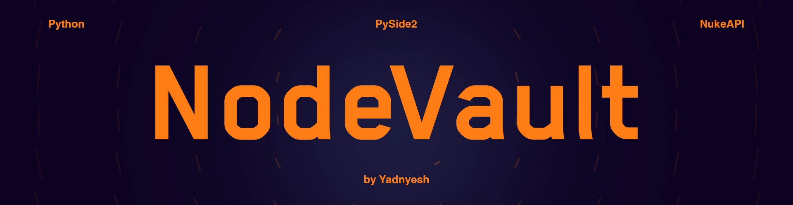

# NodeVault




<div align="center">
  <p> A local Nuke gizmo library manager — submit, browse, and subscribe to gizmos from a shared studio dataset.</p>
</div>


---

## Overview

NodeVault is a PySide2-based desktop tool built for Nuke VFX pipelines. It provides a centralized interface for artists and TDs to **submit** gizmos to a shared studio library and **browse** them from a local catalogue - complete with metadata, preview images, documentation, and external links.

---

## Features

- **Submit Tab** - Package and publish a `.gizmo` file with rich metadata:
  - File name, version, author, tagline, and description
  - Sub-category tagging (Deep, Draw, Time, Image, Channel, Filter)
  - Render type (CPU / GPU) and Nuke version compatibility flags
  - Up to 5 preview images
  - Up to 2 extra documents (DOC)
  - External links (Repo, Issues, Website, Extra)

- **Library Tab** - Browse the studio gizmo dataset:
  - Tree-view panel for navigating by category and sub-category
  - Grid display of all gizmos in the selected category
  - Detailed tab view per gizmo with full metadata, links, images, and docs
  - **Subscribe** button - copies the `.gizmo` file directly into your local `~/.nuke/NodeVault_User/` folder

- **Tab Management** — Open multiple gizmo detail tabs simultaneously with individual close controls

---

## Requirements
```
pip install -r REQUIREMENTS.txt
```
| Dependency | Version     |
|------------|-------------|
| Python     | 3.x         |
| PySide2    | 5.x         |
| Nuke       | 13+ recommended |

---

## Folder Structure

```
project_root/
├── NodeVault_Studio/          # Shared studio dataset
│   └── Gizmos/
│       └── <uuid>/
│           ├── <uuid>.json    # Metadata
│           ├── <uuid>.gizmo   # Main file
│           ├── Images/        # Preview images
│           ├── Docs/          # Extra documents
│
├── NodeVault/                 # Application source
│   ├── main.py
│   └── media/
│       └── icons/
│
~/.nuke/
└── NodeVault_User/            # Subscribed gizmos (per-user)
```

---

## Installation

WIP


---

## Usage

### Submitting a Gizmo

1. Open the **Submit** tab.
2. Fill in the **Basic Info** fields - File Name, Version, and Tagline.
3. Click **Browse** under *Main File* and select your `.gizmo` file.
4. Choose the **Sub Category**, **Render** type, and **Nuke Version**.
5. Optionally attach up to 5 preview images and 2 extra documents.
6. Add any external links (Repo, Issues, Website).
7. Click **SUBMIT**. The gizmo and all assets will be packaged under a unique UUID folder inside `NodeVault_Studio/Gizmos/`.

### Browsing the Library

1. Open the **Library** tab.
2. Click a category or sub-category in the left panel tree.
3. Click any gizmo tile in the grid to open its detail tab.
4. From the detail tab, click **Subscribe** to copy the gizmo to your local `~/.nuke/NodeVault_User/` directory.

---

## Data Format

Each submission produces a JSON metadata file:

```json
{
    "uuid": "xxxxxxxx-xxxx-xxxx-xxxx-xxxxxxxxxxxx",
    "submitted": "2025-01-01T12:00:00",
    "filetype": "Gizmo",
    "filename": "MyGizmo",
    "author": "artist_name",
    "version": 1,
    "sub_category": "Filter",
    "render": "GPU",
    "nuke_version": "Nuke13+",
    "description": "...",
    "tagline": "...",
    "extra_docs": [],
    "repo_link": "",
    "issues_link": "",
    "website": "",
    "extra_link": "",
    "attached_images": [],
    "attached_video": []
}
```

---

## Notes

- The **Author** field is auto-populated from the OS login name and is read-only.
- All submitted files are identified and stored by a UUID, preventing naming conflicts.
- The library supports re-opening multiple gizmo detail tabs simultaneously - only the root *Library* tab cannot be closed.
- `NodeVault_Studio` and its subdirectories are created automatically on first launch if they do not exist.
- There will be more future updates to this codebase.
---

